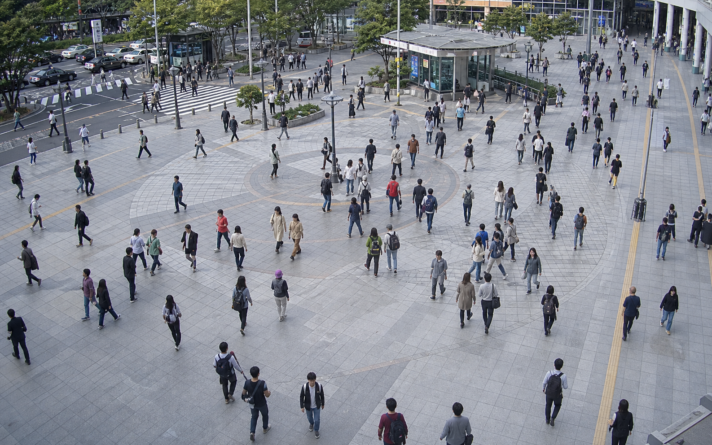
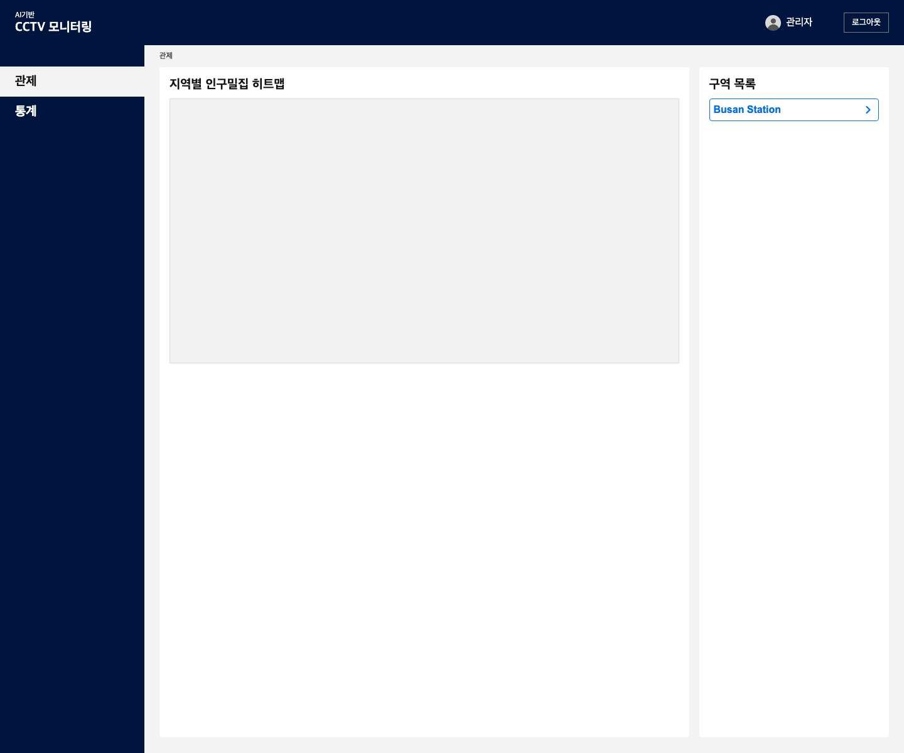
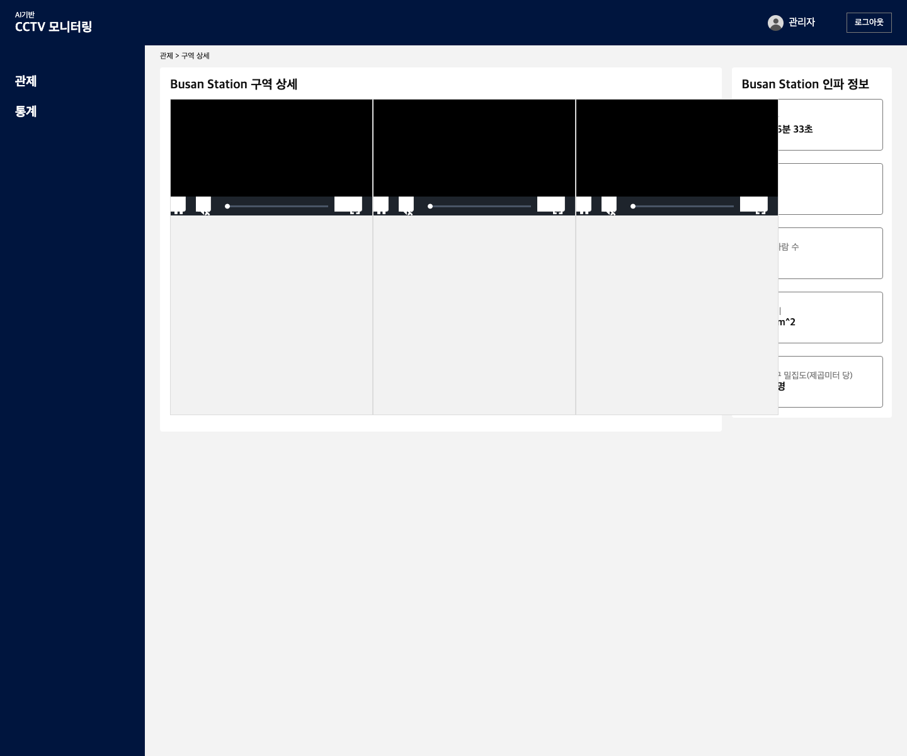
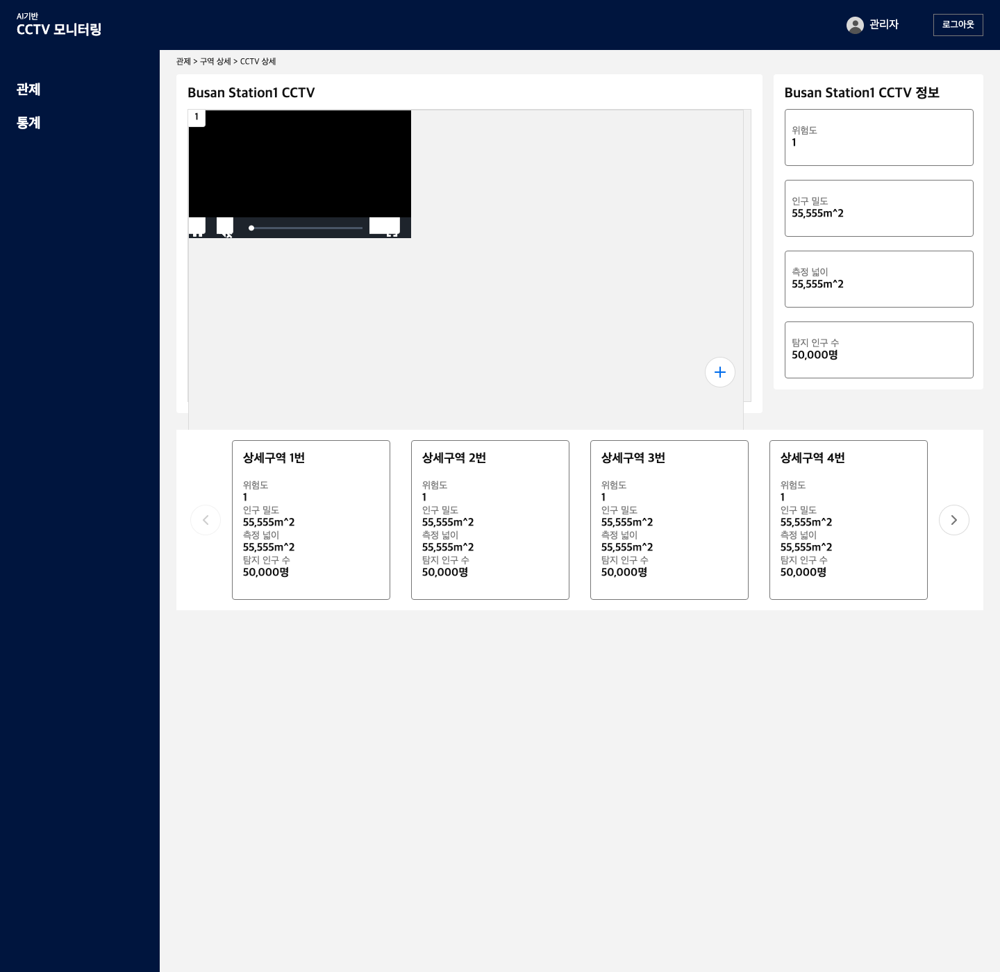

# 🚦 CCTV-Based Crowd Density Monitoring System

A real-time crowd density monitoring system designed to **prevent dangerous overcrowding incidents** (e.g., Itaewon crowd disaster) 
by analyzing live CCTV streams using AI-based smallobject detection.

---

## 🧠 Project Motivation
Large-scale crowd disasters often occur when population density exceeds safe limits without timely intervention.  
This project aims to **quantitatively assess crowd density in real time** and provide clear risk-level indicators for operators before situations become critical.

---

## 🏗 System Architecture Overview

[CCTV (RTSP)]
↓
[Flask Streaming Server]
↓
[AI Inference Server (IIM-based Model)]
↓
[Density Analysis Engine]
↓
[C# WinForms Alert System]
↓
[Optional Django Web Dashboard]

---

## 📸 Screenshots

### Simulated CCTV Feed



### Dashboard Overview



### Area Monitoring



### Detailed CCTV View



---

## ⚙️ How It Works

1. **RTSP CCTV Streaming**
   - Live CCTV footage is streamed via RTSP
   - Frames are forwarded to the AI server using a **Flask-based streaming service**
   - Install a CCTV in crowded area (e.g Busan station, Seomyeon station) to get specialized data

2. **AI-Based Crowd Analysis**
   - Uses an **IIM (Instance-aware Image Model)** for **small object detection**
   - Optimized to detect **human heads**, which are more reliable than full-body detection in dense crowds
   - Head count is calculated per frame
   - Processed transfer learning with a data created by the cctv we installed

3. **Density Estimation**
   - Crowd density is computed as:
     ```
     number of detected heads / monitored area
     ```
   - Density thresholds classify the situation into:
     - 🟢 **Normal**
     - 🟡 **Warning**
     - 🔴 **Danger**

4. **Operator Alert System**
   - A **C# WinForms application** displays real-time status
   - Clear visual indicators allow fast human decision-making

5. **Web Monitoring (Optional)**
   - A **Django-based web dashboard** was implemented for centralized monitoring
   - Web service was deploy-ready but not publicly released

---

## 🧠 AI Model
- Based on **IIM (Instance-aware Image Model)**  
  🔗 https://github.com/taohan10200/IIM
- Customized for:
  - Small object detection
  - High-density crowd scenarios
  - Robust head-count estimation

> ⚠️ **Note:**  
> The AI inference server code is **not included in this repository** due to:
> - Security considerations  
> - Large model size and private deployment constraints  

---

## 🛠 Tech Stack

**Backend / Streaming**
- Python, Flask
- RTSP video streaming

**AI / ML**
- IIM-based small object detection
- Computer vision–based head counting

**Frontend / Monitoring**
- C# WinForms (real-time alert UI on display) => What people actually watch
- Django (web-based control dashboard) => Where we manage data

**System Design**
- Distributed architecture
- Real-time data processing pipeline

---

## 🔐 Security & Deployment Notes
- AI server was deployed in a **secured private environment**
- Public repository contains:
  - System interface code
  - Streaming logic
  - Monitoring components
- AI weights and inference pipeline remain private

---

## 🚀 Key Engineering Highlights
- Designed for **real-world safety-critical use cases**
- Robust detection strategy for dense environments
- Clear separation of concerns between:
  - Streaming
  - AI inference
  - UI / monitoring
- Scalable architecture suitable for multi-camera expansion

---

## 📌 Future Improvements
- Dynamic density thresholds per location
- Cloud-based alert integration
- Multi-camera aggregation dashboard
- Calculating an area of area set by the user.

---

## 📫 Contact
If you’d like a walkthrough of the system design or implementation details:

**Christian (Hangyeom) Lee**  
📧 h38lee@uwaterloo.ca  
🔗 https://www.linkedin.com/in/hangyeom-lee-a01083250/
